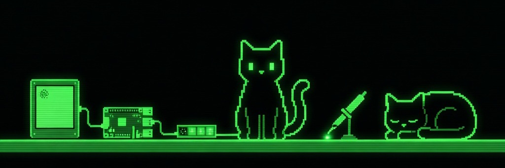

### Kayden D'Mello

Developer in Melbourne. Twelve years at ANZ, the last six as an RPA Developer / Platform Support Engineer (until December 2025). Now I ship full-stack Python services, native macOS in Swift, and embedded C/C++ on RP2040 and ESP32-S3, usually with each other on the other end of an MQTT topic.

**Currently open to work**: full-stack, automation/RPA, embedded-adjacent.

---

#### What I'm working on

[**Tesserae**](https://github.com/dmellok/tesserae): composable e-ink dashboard platform. Plugin-architected renderers and devices, 30 bundled widgets plus a [community catalog](https://github.com/dmellok/tesserae-widgets) of opt-in bundles, MQTT auto-discovery across multiple panels, Docker + bare-metal installers, [docs site](https://dmellok.github.io/tesserae/). My main project; the full ecosystem is grouped below.

[**OpenBanking Finance**](https://github.com/dmellok/openbanking-finance): self-hosted FastAPI dashboard ingesting Australian CDR transactions via Redbark. SQLModel persistence, rate-limit-aware async client, Decimal-precision money, six tabs of charts.

[**Claude Usage**](https://github.com/dmellok/claude-usage): native macOS menu-bar app for Claude Code budgets. Reads the OAuth token from Keychain, calls Anthropic's usage endpoint, publishes the result to MQTT for Home Assistant.

[**VFD Desk HUD**](https://github.com/dmellok/vfd-dash): Pi Pico W driving a 256×50 GP1287BI vacuum-fluorescent panel. 11 pages, OTA flashing, custom u8g2 fork for the BI controller, ~20 fps render loop. [Full writeup](https://dmello.io/building-a-vfd-desk-hud-with-a-pi-pico-w/?ref=github).

---

#### Tesserae ecosystem

<b>Core</b> · 3 repos

- [tesserae](https://github.com/dmellok/tesserae) · the server: composer, renderers, scheduler, MQTT push, Spectra theme system, marketplace install pipeline
- [tesserae-widgets](https://github.com/dmellok/tesserae-widgets) · the community catalog index + screenshots, audit-only review
- [homeassistant-tesserae-addon](https://github.com/dmellok/homeassistant-tesserae-addon) · HA Supervisor App (stable + edge channels)

<b>Clients</b> · 5 repos · daemons + firmware that paint a panel

- [tesserae-pi-png-client](https://github.com/dmellok/tesserae-pi-png-client) · Raspberry Pi, universal PNG path via the Pimoroni `inky` library
- [tesserae-pi-bin-client](https://github.com/dmellok/tesserae-pi-bin-client) · Raspberry Pi, fast 4-bpp `.bin` path for Inky Impression
- [tesserae-esp32-bin-client](https://github.com/dmellok/tesserae-esp32-bin-client) · Battery ESP32-S3 + Waveshare 13.3" Spectra 6
- [tesserae-esp32-bw-client](https://github.com/dmellok/tesserae-esp32-bw-client) · Battery ESP32 + Waveshare 4.2" e-paper (400×300, 1-bpp B/W)
- [tesserae-photopainter-7.3-bin-client](https://github.com/dmellok/tesserae-photopainter-7.3-bin-client) · Battery ESP32-S3 + Waveshare 7.3" Spectra 6 (PhotoPainter)

<b>Widget bundles</b> · 21 repos · install via Browse community widgets

- [tesserae-ai-brief](https://github.com/dmellok/tesserae-ai-brief) · AI-generated daily brief from weather, todos, calendar, HA entities
- [tesserae-recipes](https://github.com/dmellok/tesserae-recipes) · Schema.org Recipe scraper (RecipeTin Eats, BBC Good Food, NYT Cooking)
- [tesserae-calendar-schedule](https://github.com/dmellok/tesserae-calendar-schedule) · Google-Calendar-style agenda view, multi-feed
- [tesserae-paperlesspaper-art](https://github.com/dmellok/tesserae-paperlesspaper-art) · Full-bleed public-domain + CC art
- [tesserae-f1](https://github.com/dmellok/tesserae-f1) · Formula 1 race weekend + standings
- [tesserae-spotify](https://github.com/dmellok/tesserae-spotify) · Now playing, queue, album art
- [tesserae-github](https://github.com/dmellok/tesserae-github) · CI status, PR queue, contributions, releases
- [tesserae-finance](https://github.com/dmellok/tesserae-finance) · FX, stock, crypto
- [tesserae-sky](https://github.com/dmellok/tesserae-sky) · Aurora alerts + moon phase
- [tesserae-bom-warnings](https://github.com/dmellok/tesserae-bom-warnings) · Australian BoM weather warnings by state
- [tesserae-air-traffic](https://github.com/dmellok/tesserae-air-traffic) · Flights overhead via OpenSky Network
- [tesserae-weather-extras](https://github.com/dmellok/tesserae-weather-extras) · Air quality, pollen, wind
- [tesserae-clock-extras](https://github.com/dmellok/tesserae-clock-extras) · QLOCKTWO-style word clock, world clocks
- [tesserae-glances](https://github.com/dmellok/tesserae-glances) · Homelab host stats from a Glances API
- [tesserae-octoprint](https://github.com/dmellok/tesserae-octoprint) · OctoPrint 3D printer status
- [tesserae-unsplash](https://github.com/dmellok/tesserae-unsplash) · Daily Unsplash photo
- [tesserae-apple-album](https://github.com/dmellok/tesserae-apple-album) · iCloud Shared Album carousel
- [tesserae-transport](https://github.com/dmellok/tesserae-transport) · Melbourne PTV next departures
- [tesserae-public-holiday-countdown](https://github.com/dmellok/tesserae-public-holiday-countdown) · Countdown to the next public holiday
- [tesserae-community-demo](https://github.com/dmellok/tesserae-community-demo) · Hello-world widget for the marketplace install pipeline
- [tesserae-devref-bundle](https://github.com/dmellok/tesserae-devref-bundle) · Every plugin contract surface in one repo, for widget developers

Or filter the lot on the [topic page](https://github.com/dmellok?tab=repositories&q=topic%3Atesserae).

<b>Theme packs</b> · 6 repos · install via Browse community widgets

- [tesserae-tonal](https://github.com/dmellok/tesserae-tonal) · 6 medium-vivid feature-colour-led light themes
- [tesserae-pigment](https://github.com/dmellok/tesserae-pigment) · 10 saturated feature-colour-led light themes
- [tesserae-muted](https://github.com/dmellok/tesserae-muted) · 10 mid-tone coloured-canvas themes
- [tesserae-vivid](https://github.com/dmellok/tesserae-vivid) · 15 saturated single-colour themes
- [tesserae-gradient](https://github.com/dmellok/tesserae-gradient) · 14 linear-gradient surface themes
- [tesserae-auroras](https://github.com/dmellok/tesserae-auroras) · 6 atmospheric aurora-inspired three-stop gradient themes

---

#### Stack

**Daily** Python · Swift · C/C++ · TypeScript · MQTT
**Web** FastAPI · Flask · SQLModel · Lit · Playwright
**Native / embedded** SwiftUI · PlatformIO · arduino-pico · ESP-IDF
**AI** Anthropic API · Claude Code · MCP

---

#### Reach me

[dmello.io](https://dmello.io/?ref=github) · [LinkedIn](https://www.linkedin.com/in/dmello-io/) · <dmellok@icloud.com>
